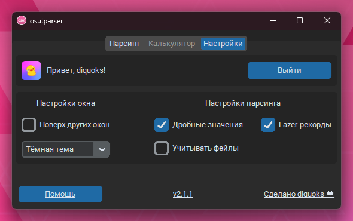
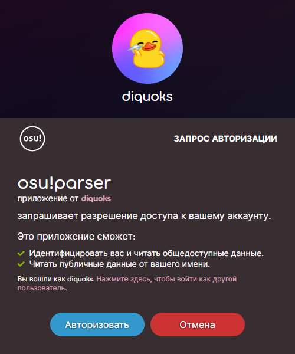
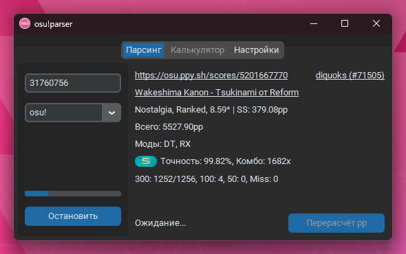

# Руководство по использованию osu!parser

```
Примечание: актуально для osu!parser v2.1.3 и выше
```

Сейчас osu!parser можно использовать для получения информации о последнем рекорде любого игрока, но с новыми обновлениями функционал будет только расширяться!

---

## Оглавление

- [Настройка osu!parser](#настройка-osuparser)
    - [Авторизация](#авторизация)
    - [Настройки](#настройки)
    - [Смена языка](#смена-языка)
- [Парсинг](#парсинг)
- [Сообщить об ошибке](#сообщить-об-ошибке)

---

## Настройка osu!parser



### Авторизация

Для того чтобы osu!parser мог отправлять запросы к osu!api, вам нужно авторизоваться с помощью вашего аккаунта osu! - сделать это можно перейдя во вкладку `Настройки` и нажав на кнопку `Войти`.



После вышеописанного вам будет предложено войти в ваш аккаунт на [osu.ppy.sh](https://osu.ppy.sh) и авторизоваться.  
При успешной авторизации вас перенаправит на [diquoks.ru](https://diquoks.ru) и отобразит предупреждение о статусе авторизации.

### Настройки

| Настройка          | Описание                                                        |
|--------------------|-----------------------------------------------------------------|
| Поверх других окон | Будет ли osu!parser виден при фокусе на другом окне поверх него |
| Выбор темы         | Позволяет выбрать тему приложения                               |
| Дробные значения   | Отображает значения атрибутов после запятой                     |
| Lazer-рекорды      | Показывает рекорды, поставленные в новом клиенте osu!(lazer)    |
| Учитывать фейлы    | Показывает сфейленные рекорды                                   |

```
Примечание: настройки могут быть изменены прямо во время парсинга, изменения вступят в силу при следующей итерации!
```

### Смена языка

Смена языка появится в будущем обновлении.

---

## Парсинг

В разделе `Парсинг` вы можете получать информацию о последнем рекорде любого игрока.  
Для этого введите его ID и выберите нужный режим игры, после чего нажмите на кнопку `Запустить`



```
Примечание: парсинг прекратится, если во время него возникнет ошибка.
Если ошибка многократно повторяется - сообщите о ней разработчику, прикрепив свои логи - он постарается помочь как можно скорее!
```

---

## [Сообщить об ошибке](README.md)
